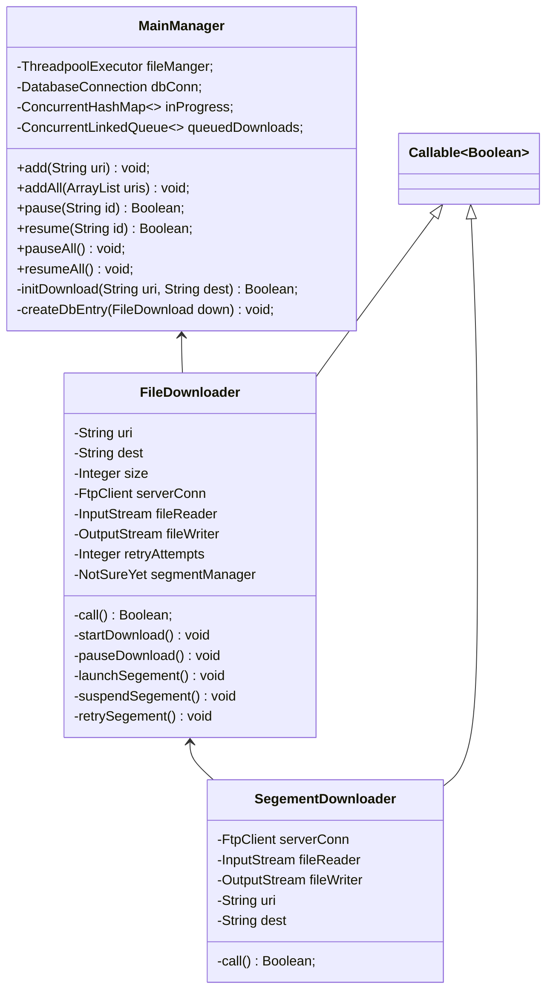

# CS471: Internet File Downloader

## Class Diagram
---

```mermaid
classDiagram
class MainManager{
-ThreadpoolExecutor fileManger;
-DatabaseConnection dbConn;
-ConcurrentHashMap<> inProgress;
-ConcurrentLinkedQueue<> queuedDownloads;

+add(String uri) void;
+addAll(ArrayList<String> uris) void;
+pause(String id) Boolean;
+resume(String id) Boolean;
+pauseAll() void;
+resumeAll() void;

-initDownload(String uri, String dest) Boolean;
-createDbEntry(FileDownload down) void;
}
MainManager <-- FileDownloader
Callable~Boolean~ <|-- FileDownloader
class FileDownloader{
-String uri
-String dest
-Integer size 
-FtpClient serverConn 
-InputStream fileReader
-OutputStream fileWriter
-Integer retryAttempts
-NotSureYet segmentManager

-call() Boolean;

-startDownload() void
-pauseDownload() void
-launchSegement() void
-suspendSegement() void
-retrySegement() void
}

FileDownloader <-- SegementDownloader
Callable~Boolean~ <|-- SegementDownloader
class SegementDownloader{
-FtpClient serverConn 
-InputStream fileReader
-OutputStream fileWriter
-String uri
-String dest

-call() Boolean;
}
```
---

