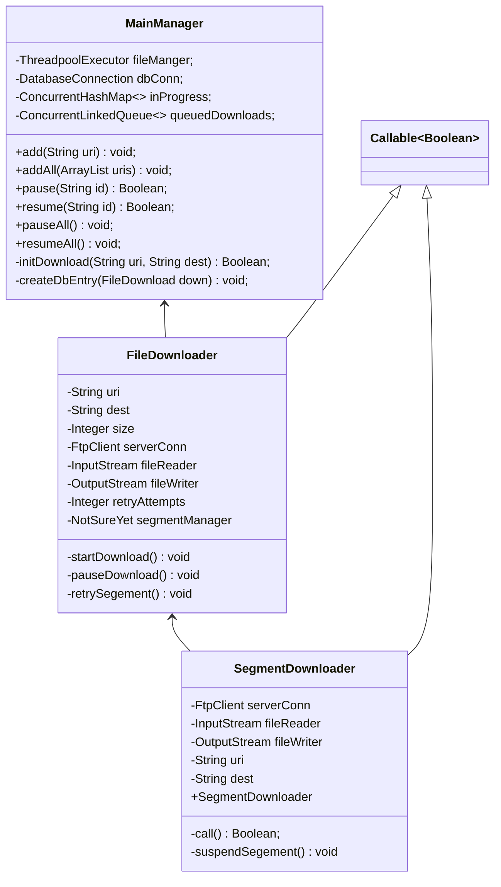

# CS471: Internet File Downloader

## Class Diagram
---

---
## Class Descriptions
---
- **MainManger**: responsible for linking between GUI and logic, opening the DB conn, and loading user preferences.
- **FileDownloader**: responsible for allocating space and file,  managing the threads that download the file in chunks, recombining the chunks, and if paused storing the status of the file in DB for later continuation.
- **SegmentDownloader**: responsible for creating passive FTP link with server and downloading the chunk from a provided offset into a *.part* file.
